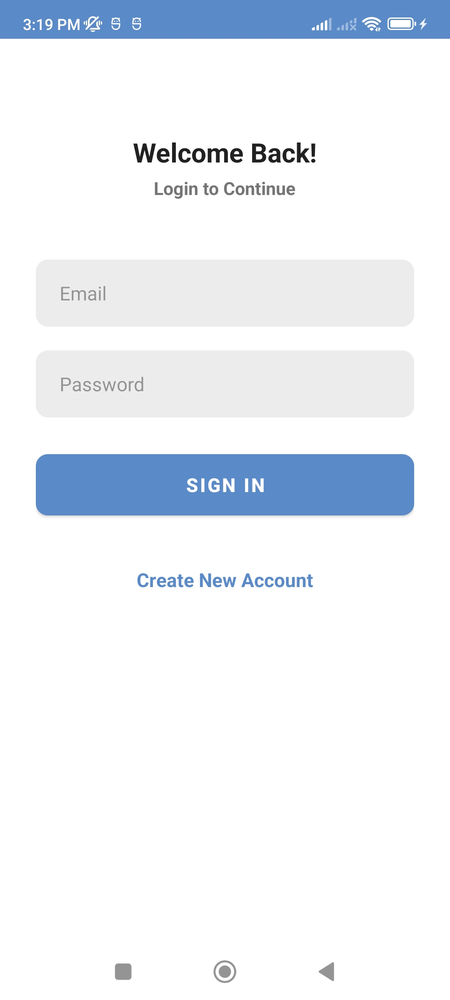
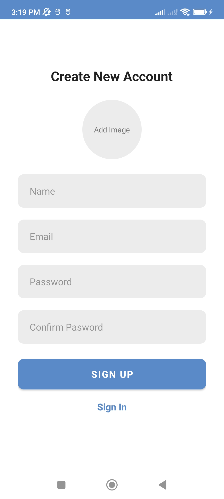
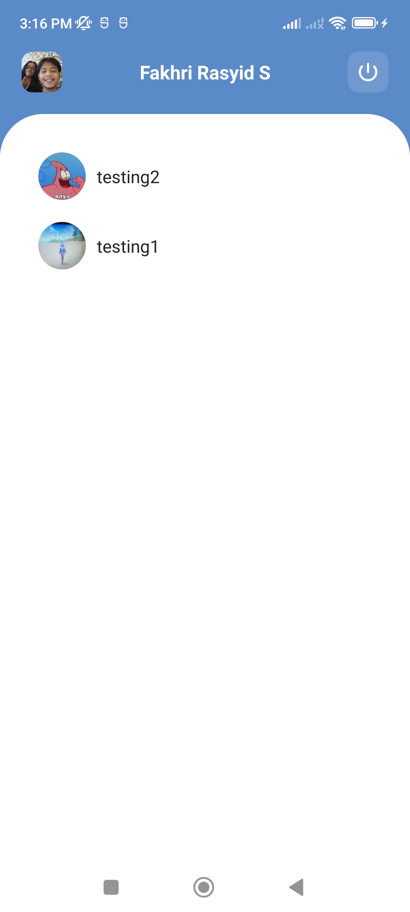
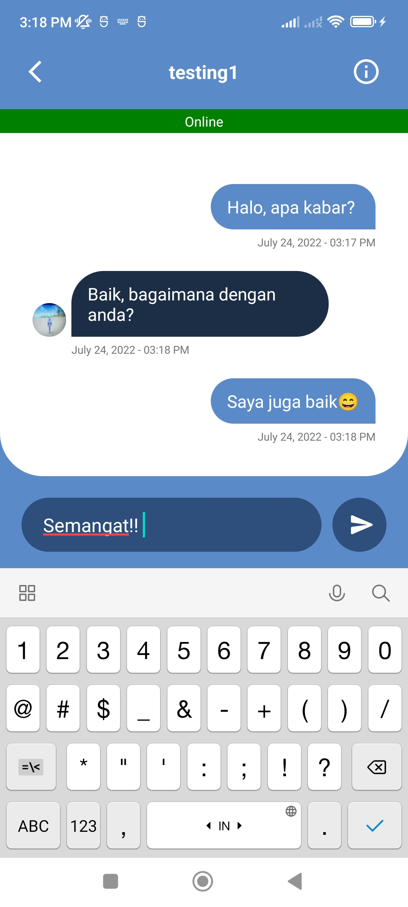
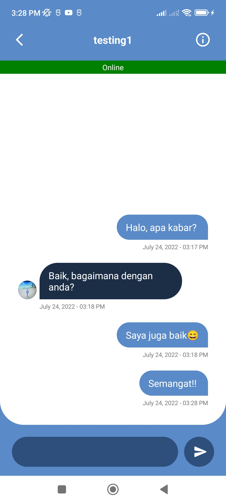
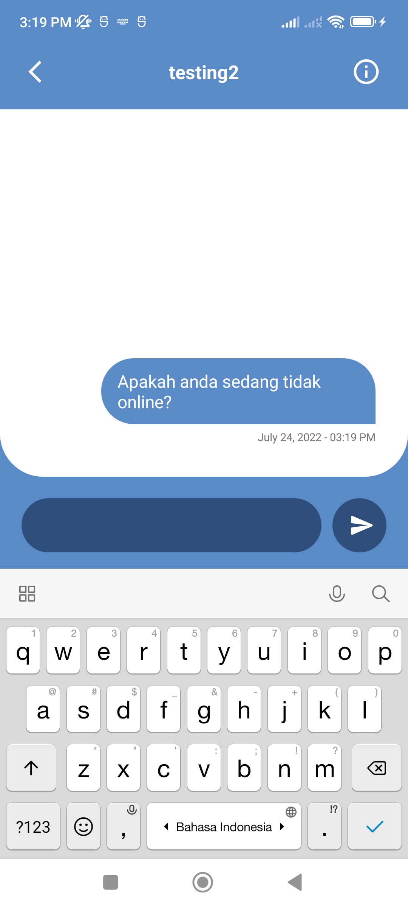

# Simple Chat App - Android

Simple Chat App built with Kotlin, developed using [Firebase FireStore](https://firebase.google.com/products/firestore) with [Preferences Datastore](https://developer.android.com/topic/libraries/architecture/datastore?hl=id) with MVVM Architecture to retrieve latest login information. 

## Features

- Chat database with [Firebase FireStore](https://firebase.google.com/products/firestore)
- Implementing MVVM Architecture
- Check the availability of the user (online or offline)

## Screenshots
|  |  |   |
| :---:                              | :---:                             | :---:                              |
|   |  |   |
|   |  |   |

## Todo
- Fix some recyclerview in chat problems
- Add Recent Chat feature
= Add Notification
